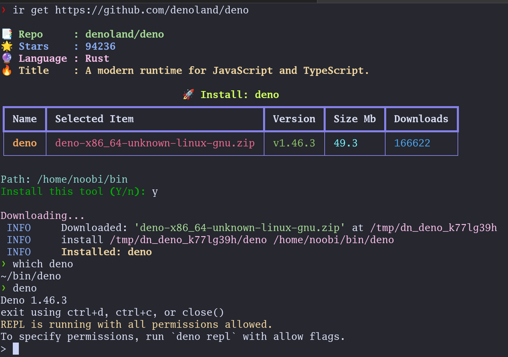

# install-release 🚀
[](https://shields.io/) [](https://pepy.tech/project/install-release)

`install-release` is a cli tool to install any tool for your device directly from their github releases and keep them updated. you can consider it as a small package manager for github releases.

This can be any tool you want to install, which is pre-compiled for your device and present on github releases.

> Also it's mainly for installing tools that are not directly available in the officially by package managers `apt, yum, pacman` etc.

```bash
# Install install-release
pip install -U install-release
```

```
# Example Installation a tool named `gron` directly from its github releases

# install-release get [GITHUB-URL]

❯ install-release get https://github.com/tomnomnom/gron 
```




Checking for gron is installed using installed-release:

```
❯ which gron
/home/noobi/.release-bin/gron

❯ gron --help
Transform JSON (from a file, URL, or stdin) into discrete assignments to make it greppable
... # more
```

## Prerequisites

- python3.8 or higher

- [libmagic](https://github.com/ahupp/python-magic#installation)
- Default releases Installation Path is: `~/.release-bin/`,
This is the path where installed tools will get stored.

- In order to run installed tools, you need to add the following line your `~/.bashrc` or `~/.zshrc` file:

```bash
export PATH=$HOME/.release-bin:$PATH
```


## Install this package

```bash
pip install -U install-release
```


### Example usage `install-release`


```
# Help page

❯ install-release --help
Usage: install-release [OPTIONS] COMMAND [ARGS]...

  Github Release Installer, based on your system

  Commands:
    get      | Install github release, cli tool
    ls       | list all installed release, cli tools
    rm       | remove any installed release, cli tools
    upgrade  | Upgrade all installed release, cli tools
    state    | show currnet stored state
    config   | Set configs for tool
    pull     | Install tools from remote state
    version  | print version of install-release 
```

For sub command help use: `install-release <sub-command> --help`

Example: `install-release get --help`


You can shorten the command by setting alias to your `.bashrc` or `.zshrc`

```bash
alias ir="install-release"
```
after this you can you alias directly for easiness

Example: `ir get --help`

#### Install tool from github releases

```bash
❯ install-release get "https://github.com/ahmetb/kubectx"

📑 Repo     : ahmetb/kubectx
🌟 Stars    : 13295
✨ Language : Go
🔥 Title    : Faster way to switch between clusters and namespaces in kubectl

                              🚀 Install: kubectx                               
┏━━━━━━━━━┳━━━━━━━━━━━━━━━━━━━━━━━━━━━━━━━━━━━━┳━━━━━━━━━┳━━━━━━━━━┳━━━━━━━━━━━┓
┃ Name    ┃ Selected Item                      ┃ Version ┃ Size Mb ┃ Downloads ┃
┡━━━━━━━━━╇━━━━━━━━━━━━━━━━━━━━━━━━━━━━━━━━━━━━╇━━━━━━━━━╇━━━━━━━━━╇━━━━━━━━━━━┩
│ kubectx │ kubectx_v0.9.4_linux_x86_64.tar.gz │ v0.9.4  │ 1.0     │ 43811     │
└─────────┴────────────────────────────────────┴─────────┴─────────┴───────────┘
Install this tool (Y/n): y
 INFO     Downloaded: 'kubectx_v0.9.4_linux_x86_64.tar.gz' at /tmp/dn_kubectx_ph6i7dmk                                                               utils.py:159
 INFO     install /tmp/dn_kubectx_ph6i7dmk/kubectx /home/noobi/.release-bin/kubectx                                                                  core.py:132
 INFO     Installed: kubectx
```
```
# checking if kubectx is installed
❯ which kubectx
/home/noobi/.release-bin/kubectx

❯ kubectx --version
0.9.4
```

#### List installed tools

```bash
❯ install-release ls

                       Installed tools                        
┏━━━━━━━━━━━┳━━━━━━━━━┳━━━━━━━━━━━━━━━━━━━━━━━━━━━━━━━━━━━━━━┓
┃ Name      ┃ Version ┃ Url                                  ┃
┡━━━━━━━━━━━╇━━━━━━━━━╇━━━━━━━━━━━━━━━━━━━━━━━━━━━━━━━━━━━━━━┩
│ terrascan │ v1.15.2 │ https://github.com/tenable/terrascan │
│ gron      │ v0.7.1  │ https://github.com/tomnomnom/gron    │
│ kubectx   │ v0.9.4  │ https://github.com/ahmetb/kubectx    │
└───────────┴─────────┴──────────────────────────────────────┘    
```

#### Remove installed release

```bash
# Remove installed release

❯ install-release rm gron
    
INFO     Removed: gron           
```

#### Update all previously installed tools to the latest version

```bash
❯ install-release upgrade

Fetching: https://github.com/tenable/terrascan#terrascan
Fetching: https://github.com/ahmetb/kubectx#kubectx

Following tools will be upgraded:

terrascan

Upgrade these tools, (Y/n): y

Updating: terrascan, v1.15.0 => v1.15.2
 INFO     Downloaded: 'terrascan_1.15.2_Linux_x86_64.tar.gz' at /tmp/dn_terrascan_0as71a6v
 INFO     install /tmp/dn_terrascan_0as71a6v/terrascan ~/.release-bin/terrascan
 INFO     Installed: terrascan

Progress... ━━━━━━━━━━━━━━━━━━━━━━━━━━━━━━━━━━━━━━━━ 100% 0:00:00 
```

#### Hold Update to specific installed tool.

In case you want to hold update to specific tool, you can use `hold {tool-name}` command by which it will pause update for that tool.

Example: keep tool named [k9s](https://github.com/derailed/k9s) update on hold

```bash
❯ install-release hold k9s
 INFO     Update on hold for, k9s to True
```

You can list tools on hold updates  by `ls --hold` command

```bash
❯ install-release ls --hold
             Installed tools kept on hold             
┏━━━━━━┳━━━━━━━━━┳━━━━━━━━━━━━━━━━━━━━━━━━━━━━━━━━━━━┓
┃ Name ┃ Version ┃ Url                               ┃
┡━━━━━━╇━━━━━━━━━╇━━━━━━━━━━━━━━━━━━━━━━━━━━━━━━━━━━━┩
│ k9s  │ v0.26.7 │ https://github.com/derailed/k9s   │
└──────┴─────────┴───────────────────────────────────┘
```

In case you want to unhold update to specific tool, you can use `hold --unset {tool-name}` command by which it will pause update for that tool.

```
❯ install-release hold --unset k9s
 INFO     Update on hold for, k9s to False
```

#### Config tool installation path

```bash
❯ install-release config --path ~/.local/bin

INFO   updated path to:  ~/.local/bin
INFO   Done
```

#### Config github to token for higher rate limit


```bash
❯ install-release config --token [your github token]

INFO: Update token
INFO: Done.
```
