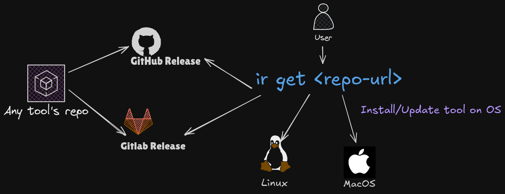

<h1 align="center">
<br>
🐧 Install Release 
</h1>

<p align="center">
  <a href="https://shields.io/">
    
  </a>
  <a href="https://pepy.tech/project/install-release">
    
  </a>
<p>

<br>

**Install Release** is a CLI tool by name `ir` to install any single-binary executable package for your device(Linux/MacOS/WSL) directly from their GitHub or GitLab releases and keep them updated. Consider it as a CLI to install, update and remove any single binary tools from GitHub/GitLab releases.

This can be any tool you want to install, which is pre-compiled for your device and present on GitHub or GitLab releases.

> INFO: It's mainly for installing tools that are not directly available officially by package managers like `apt, yum, pacman, brew` etc.

<p align="center">
  
</p>

<!-- Table of content -->

## Table of Contents 📚

- [Table of Contents 📚](#table-of-contents-)
- [Getting started ⚡](#getting-started)
  - [Installation](#installation)
  - [Manage your tools](#manage-your-tools)
- [Prerequisites 📋](#prerequisites-)
- [Updating `install-release` 🔄](#updating-install-release-)
- [Example usage `ir --help` 💡](#example-usage-ir---help-)
  - [Install completion for cli 🎠](#install-completion-for-cli-)
  - [Install tool from GitHub/GitLab releases 🌈](#install-tool-from-githubgitlab-releases-)
  - [Install specific release asset from GitHub/GitLab releases 🔦](#install-specific-release-asset-from-githubgitlab-releases-)
    - [Method 1: Interactive Selection (Recommended)](#method-1-interactive-selection-recommended)
    - [Method 2: Command-line Flag](#method-2-command-line-flag)
  - [List installed tools 📋](#list-installed-tools-)
  - [Remove installed release ❌](#remove-installed-release-)
  - [Update all previously installed tools to the latest version 🕶️](#update-all-previously-installed-tools-to-the-latest-version-)
  - [Pull state templates for installing tools 📄](#pull-state-templates-for-installing-tools-)
  - [Hold Update to specific installed tool ✋](#hold-update-to-specific-installed-tool-)
  - [Configure tool installation path 🗂️](#config-tool-installation-path)
  - [Configure updates for pre-release versions 🔌](#config-updates-for-pre-release-versions-)
  - [Configure GitHub/GitLab tokens for higher rate limit 🔑](#configure-githubgitlab-tokens-for-higher-rate-limit-)


## Getting started


### Installation

**Prerequisites:**

- Python 3.9 or higher
- pip

**Installation command:**

```bash
pip install -U install-release
```

**Set up the PATH for shell (e.g. ~/.bashrc or ~/.zshrc):**

Tools installed via `ir` will be installed to `~/bin` by default. 

```bash
export PATH="$HOME/bin:$PATH" 
```

If you want to change the installation path, you can use the `ir config --path <path>` flag.

---

### Manage your tools

Example: Installing [deno (Rust-based JavaScript runtime)](https://github.com/denoland/deno) directly from its GitHub releases:

```bash
# Usage: ir get [GITHUB-URL or GITLAB-URL]
❯ ir get https://github.com/denoland/deno
```

Verify the installation:

```bash
❯ which deno
~/bin/deno

❯ deno --version
deno 1.46.3 ...
```

Example: Installing [GitLab CLI](https://gitlab.com/gitlab-org/cli) with a custom binary name `glab`:

```bash
❯ ir get https://gitlab.com/gitlab-org/cli -n glab
```

Verify the installation:

```bash
❯ which glab
~/bin/glab

❯ glab --version
glab 1.80.0 ...
```

Once installed, you can manage your tools with these simple commands:

- **List**: `ir ls` — See all installed tools and versions.
- **Update**: `ir upgrade` — Upgrade all installed tools to their latest releases.
- **Remove**: `ir rm deno` — Remove a tool from your system.

For more details, check the [Table of Contents](#table-of-contents-).

## Prerequisites 📋

- python3.8 or higher
- [libmagic](https://github.com/ahupp/python-magic#installation)
- Default installation path: `~/bin/` (Ensure this is in your `PATH`)

```bash
# Add this to your ~/.bashrc or ~/.zshrc
export PATH=$HOME/bin:$PATH
```

## Updating `install-release` 🔄

For seeing version:

```bash
ir me --version
```

For updating:

```bash
ir me --upgrade
```

## Example usage `ir --help` 💡

```
# Help page

❯ ir --help
Usage: ir [OPTIONS] COMMAND [ARGS]...

  GitHub / GitLab release installer based on your system (Linux/MacOS)

  Commands:
    get      | Install GitHub/GitLab repository CLI tool from its releases
    ls       | List all installed CLI tools
    rm       | Remove any installed CLI tool
    upgrade  | Upgrade all installed CLI tools from their repositories
    state    | Show the current stored state of Install-Release
    config   | Set configs for Install-Release
    pull     | Install tools from the remote install-release state URL
    hold     | Keep an installed CLI tool's updates on hold.
    me       | Update the Install-Release tool.
```

For sub-command help use: `ir <sub-command> --help`

Example: `ir get --help`

#### Install completion for cli 🎠

```bash
# ir --install-completion [SHELL: bash|zsh|fish|powershell]
# Example for zsh:
ir --install-completion zsh
```

#### Install tool from GitHub/GitLab releases 🌈

```bash
❯ ir get "https://github.com/ahmetb/kubectx"

📑 Repo     : ahmetb/kubectx
🌟 Stars    : 13295
✨ Language : Go
🔥 Title    : Faster way to switch between clusters and namespaces in kubectl

                              🚀 Install: kubectx
┏━━━━━━━━━┳━━━━━━━━━━━━━━━━━━━━━━━━━━━━━━━━━━━━┳━━━━━━━━━┳━━━━━━━━━┳━━━━━━━━━━━┓
┃ Name    ┃ Selected Item                      ┃ Version ┃ Size Mb ┃ Downloads ┃
┡━━━━━━━━━╇━━━━━━━━━━━━━━━━━━━━━━━━━━━━━━━━━━━━╇━━━━━━━━━╇━━━━━━━━━╇━━━━━━━━━━━┩
│ kubectx │ kubectx_v0.9.4_linux_x86_64.tar.gz │ v0.9.4  │ 1.0     │ 43811     │
└─────────┴────────────────────────────────────┴─────────┴─────────┴───────────┘
Install this tool (Y/n/?): y
 INFO     Downloaded: 'kubectx_v0.9.4_linux_x86_64.tar.gz' at /tmp/dn_kubectx_ph6i7dmk                                                               utils.py:159
 INFO     install /tmp/dn_kubectx_ph6i7dmk/kubectx /home/noobi/bin/kubectx                                                                  core.py:132
 INFO     Installed: kubectx
```

```
# checking if kubectx is installed
❯ which kubectx
/home/noobi/bin/kubectx

❯ kubectx --version
0.9.4
```

#### Install specific release asset from GitHub/GitLab releases 🔦

In rare cases where install-release does not automatically find the correct release file for your system, you can manually specify the release file name. There are two ways to do this:

##### Method 1: Interactive Selection (Recommended)

During the installation prompt, type `?` to view all available release assets and select the one you want:

```bash
❯ ir get https://github.com/ekzhang/bore

📑 Repo     : ekzhang/bore
🌟 Stars    : 8234
✨ Language : Rust
🔥 Title    : A simple CLI tool for making tunnels to localhost

                              🚀 Install: bore
┏━━━━━━┳━━━━━━━━━━━━━━━━━━━━━━━━━━━━━━━━━━━━━━━━━━┳━━━━━━━━━┳━━━━━━━━━┳━━━━━━━━━━━┓
┃ Name ┃ Selected Item                            ┃ Version ┃ Size Mb ┃ Downloads ┃
┡━━━━━━╇━━━━━━━━━━━━━━━━━━━━━━━━━━━━━━━━━━━━━━━━━━╇━━━━━━━━━╇━━━━━━━━━╇━━━━━━━━━━━┩
│ bore │ bore-v0.4.0-x86_64-unknown-linux-musl... │ v0.4.0  │ 1.2     │ 1523      │
└──────┴──────────────────────────────────────────┴─────────┴─────────┴───────────┘

Path: /home/noobi/bin
Install this tool (Y/n/?): ?

                    📦 Available Assets for bore
┏━━━━┳━━━━━━━━━━━━━━━━━━━━━━━━━━━━━━━━━━━━━━━━━━━━━━━━━┳━━━━━━━━━━━┳━━━━━━━━━━━┓
┃ ID ┃ Filename                                        ┃ Size (MB) ┃ Downloads ┃
┡━━━━╇━━━━━━━━━━━━━━━━━━━━━━━━━━━━━━━━━━━━━━━━━━━━━━━━━╇━━━━━━━━━━━╇━━━━━━━━━━━┩
│ 1  │ bore-v0.4.0-x86_64-unknown-linux-musl.tar.gz    │ 1.2       │ 1523      │
│ 2  │ bore-v0.4.0-x86_64-unknown-linux-gnu.rpm        │ 1.3       │ 845       │
│ 3  │ bore-v0.4.0-aarch64-unknown-linux-musl.deb      │ 1.1       │ 234       │
│ 4  │ bore-v0.4.0-x86_64-apple-darwin.dmg             │ 1.2       │ 456       │
│ 5  │ bore-v0.4.0-x86_64-apple-darwin.tar.gz          │ 1.2       │ 1523      │
└────┴─────────────────────────────────────────────────┴───────────┴───────────┘

Enter your desired file ID to install (or 'n' to cancel): 3
```

The tool will automatically parse the selected filename into keywords and store them for future upgrades.

##### Method 2: Command-line Flag

You can also specify the release file name directly using the `-a` flag:

```bash
❯ ir get [GITHUB-URL or GITLAB-URL] -a [release asset filename]
```

Example: Installing the bore tool from GitHub with the release file name `bore-v0.4.0-arm-unknown-linux-musleabi.tar.gz`. Here, the keywords generated are: `bore, v0.4.0, arm, linux, musleabi`

```bash
❯ ir get https://github.com/ekzhang/bore -a bore-v0.4.0-arm-unknown-linux-musleabi.tar.gz
```

**How it works:**
- The tool parses the release file name into keywords (removing version numbers and file extensions)
- These keywords are stored in the state file to match the correct release file during future tool upgrades
- This ensures consistent upgrades to the same release variant

> Note: If `install-release` fails to identify the correct release package for your system, please raise a GitHub issue to help improve the tool.

#### List installed tools 📋

```bash
❯ ir ls

                       Installed tools
┏━━━━━━━━━━━┳━━━━━━━━━┳━━━━━━━━━━━━━━━━━━━━━━━━━━━━━━━━━━━━━━┓
┃ Name      ┃ Version ┃ Url                                  ┃
┡━━━━━━━━━━━╇━━━━━━━━━╇━━━━━━━━━━━━━━━━━━━━━━━━━━━━━━━━━━━━━━┩
│ terrascan │ v1.15.2 │ https://github.com/tenable/terrascan │
│ gron      │ v0.7.1  │ https://github.com/tomnomnom/gron    │
│ kubectx   │ v0.9.4  │ https://github.com/ahmetb/kubectx    │
└───────────┴─────────┴──────────────────────────────────────┘
```

#### Remove installed release ❌

```bash
# Remove installed release

❯ ir rm gron

INFO     Removed: gron
```

#### Update all previously installed tools to the latest version 🕶️

```bash
❯ ir upgrade

Fetching: https://github.com/tenable/terrascan#terrascan
Fetching: https://github.com/ahmetb/kubectx#kubectx

Following tools will be upgraded:

terrascan

Upgrade these tools (Y/n): y

Updating: terrascan, v1.15.0 => v1.15.2
 INFO     Downloaded: 'terrascan_1.15.2_Linux_x86_64.tar.gz' at /tmp/dn_terrascan_0as71a6v
 INFO     install /tmp/dn_terrascan_0as71a6v/terrascan ~/bin/terrascan
 INFO     Installed: terrascan

Progress... ━━━━━━━━━━━━━━━━━━━━━━━━━━━━━━━━━━━━━━━━ 100% 0:00:00
```

#### Pull state templates for installing tools 📄

You can push your state to somewhere like GitHub and use it on any other device to sync the tools installed via ir.

```bash
❯ ir pull --url https://raw.githubusercontent.com/Rishang/dotFiles/main/templates/install-release/state.json
```

#### Hold Update to specific installed tool ✋

In case you want to hold an update for a specific tool, you can use the `hold {tool-name}` command which will pause updates for that tool.

Example: Keep tool named [k9s](https://github.com/derailed/k9s) update on hold:

```bash
❯ ir hold k9s
 INFO     Update on hold for, k9s to True
```

You can list tools on hold updates by using the `ls --hold` command:

```bash
❯ ir ls --hold
             Installed tools kept on hold
┏━━━━━━┳━━━━━━━━━┳━━━━━━━━━━━━━━━━━━━━━━━━━━━━━━━━━━━┓
┃ Name ┃ Version ┃ Url                               ┃
┡━━━━━━╇━━━━━━━━━╇━━━━━━━━━━━━━━━━━━━━━━━━━━━━━━━━━━━┩
│ k9s  │ v0.26.7 │ https://github.com/derailed/k9s   │
└──────┴─────────┴───────────────────────────────────┘
```

In case you want to remove the update hold for a specific tool, you can use the `hold --unset {tool-name}` command:

```
❯ ir hold --unset k9s
 INFO     Update on hold for, k9s to False
```

#### Configure tool installation path

```bash
❯ ir config --path ~/.local/bin

INFO   Updated path to:  ~/.local/bin
INFO   Done
```

#### Configure updates for pre-release versions 🔌

This is useful when you want to install pre-release versions of tools like beta or alpha releases. By default, it is set to `False`, in which case it will only check for the latest stable release.

```bash
❯ ir config --pre-release
```

#### Configure GitHub/GitLab tokens for higher rate limit 🔑

> For GitHub:

```bash
❯ ir config --github-token [your github token]

INFO: Updated GitHub token
INFO: Done.
```

> For GitLab:

```bash
❯ ir config --gitlab-token [your gitlab token]

INFO: Updated GitLab token
INFO: Done.
```
